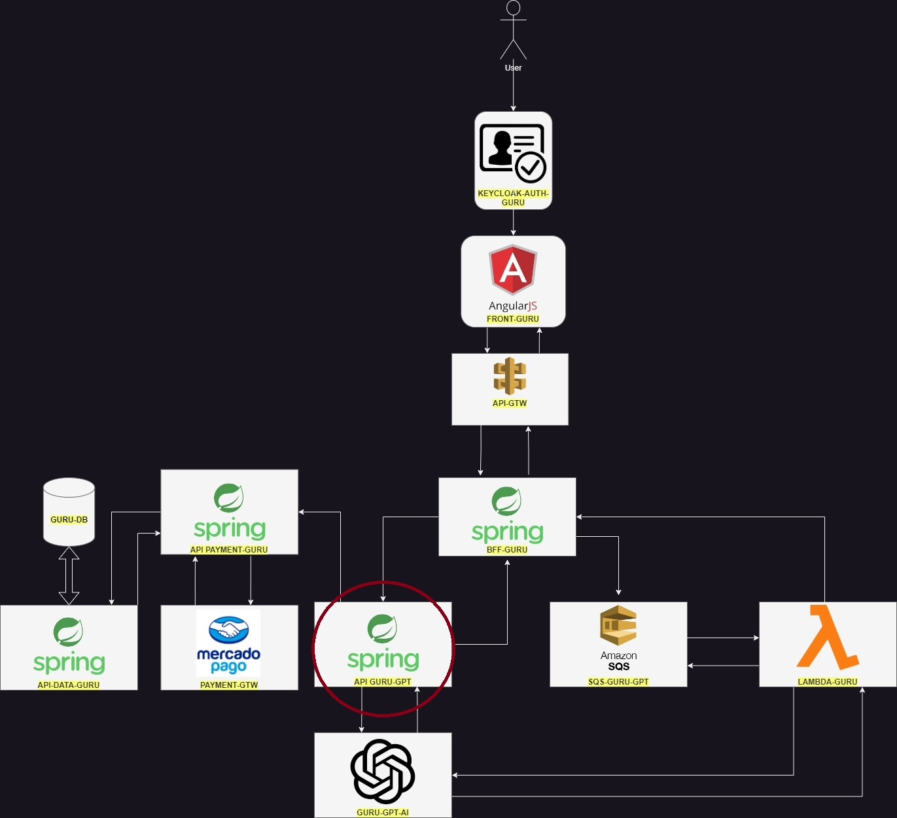

# 🤖 Guru-GPT API Documentation 🤖

Welcome to the **Guru-GPT API** documentation! This document provides you with all the necessary information to get started with our API, designed to power the backend of the *Guru* application. Our API leverages a hexagonal architecture, ensuring a clean separation of concerns, and is built with Kotlin, providing a robust and type-safe backend solution.

## Table of Contents

- [Getting Started](#getting-started)
  - [Prerequisites](#prerequisites)
  - [Installation](#installation)
- [API Reference](#api-reference)
  - [Numerology Map Endpoint](#numerology-map-endpoint)
- [Development](#development)
  - [Architecture](#architecture)
  - [Database](#database)
  - [SonarCloud Analytics](#sonar)
- [Contributing](#contributing)
- [License](#license)
## Getting Started

To get started with Guru-GPT API, you'll need to have a few items set up and installed on your machine.

### Prerequisites

Before you can run the Guru-GPT API, please make sure you have the following installed:
- Java JDK 17
- Your preferred IDE (IntelliJ IDEA, Eclipse, VSCode, etc.)
- Docker
### Installation
1. **Clone the repository:**
   ```sh
   git clone https://github.com/GabrielPedrico/api-guru-gpt.git
2. **Set your own GPT variables:**
   You have to set a few variables to run the application and successfully make a request. The variables you must set are:
   - OPENAI_URL
   - OPENAI_ASSISTANT
   - OPENAI_TOKEN
   - OPENAI_HEADER
   
   Example:
   ```sh
   OPENAI_URL=https://api.openai.com/v1/threads;OPENAI_ASSISTANT=asst_yourgptassisthere;OPENAI_TOKEN=Bearer yourgpttokenhere;OPENAI_HEADER=assistants=v1
3. **Run the application:**
   You can just run the application, through your IDE just hitting play or build and run the .JAR file


## API Reference

Currently, Guru-GPT API provides a single endpoint that can be used to interact with the system.

### Numerology Map Endpoint

- **URL**: `http://localhost:8080/numerology_map`
- **Method**: `POST`
- **REQUEST BODY**:
  ```json
  {
    "user_id": "e16d1585-3e17-4157-a51c-8b259dc45035"
  }
- **RESPONSE BODY**:
    ```json
  {
  "thread_id": "thread_0bfEMfO3KtwuiKVuh4dummy",
	"created_at": 1712353067,
	"status": "queued"
  }

## Development

### Architecture

Guru-GPT API is built using hexagonal architecture, which allows us to keep our core logic decoupled from external services and databases. This architecture makes our application more maintainable and scalable.

### Database

We use PostgreSQL as our database. The schema and initial setup are managed using Docker, making it easy to start the development environment with consistent database configuration.

### Where is the API-GURU-GPT in the Guru's flow


### Sonar
[](https://sonarcloud.io/summary/new_code?id=GabrielPedrico_api-guru-gpt) [](https://sonarcloud.io/summary/new_code?id=GabrielPedrico_api-guru-gpt) [](https://sonarcloud.io/summary/new_code?id=GabrielPedrico_api-guru-gpt) [](https://sonarcloud.io/summary/new_code?id=GabrielPedrico_api-guru-gpt) [](https://sonarcloud.io/summary/new_code?id=GabrielPedrico_api-guru-gpt) [](https://sonarcloud.io/summary/new_code?id=GabrielPedrico_api-guru-gpt) [](https://sonarcloud.io/summary/new_code?id=GabrielPedrico_api-guru-gpt) [](https://sonarcloud.io/summary/new_code?id=GabrielPedrico_api-guru-gpt) [](https://sonarcloud.io/summary/new_code?id=GabrielPedrico_api-guru-gpt) 

## Contributing

We welcome contributions from the community! If you'd like to contribute, please follow the standard fork-and-pull request workflow.

## License

Guru-GPT API is released under the MIT License. See the LICENSE file for more details.

